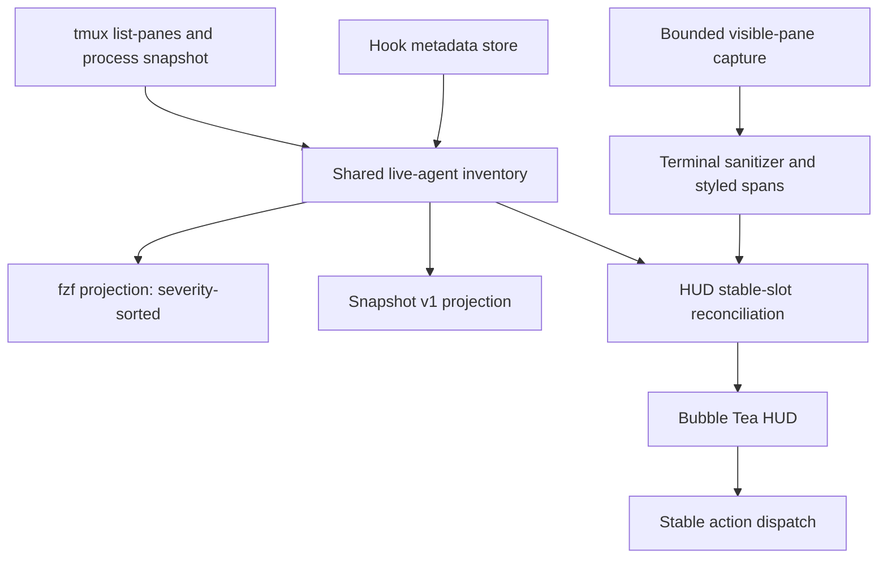
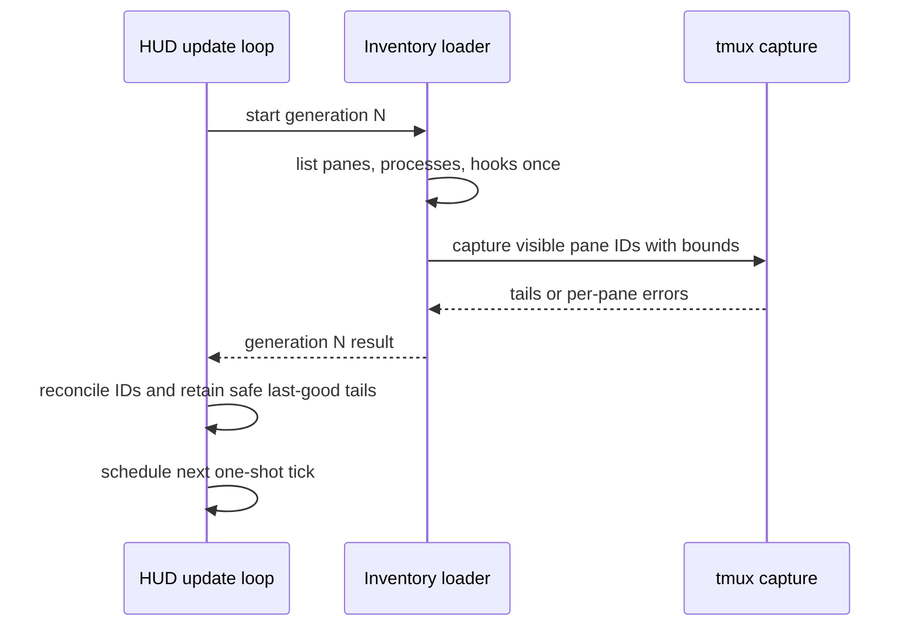
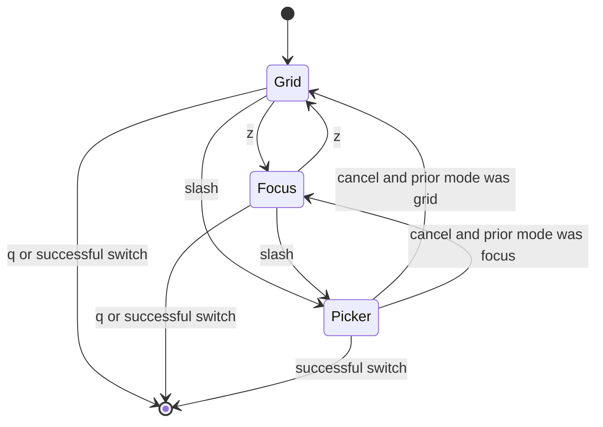

# Agent Live HUD - Plan

## Goal Capsule

- **Objective:** Let an operator continuously monitor visible agent output, retain status and attention awareness across all live agent panes, and jump to the exact pane without manually refreshing a picker.
- **Means:** Make `agents` open an adaptive Bubble Tea HUD with a stable live grid, focused inspection, and the existing fzf Agents picker as the fuzzy switch surface (KTD1, KTD5, KTD7).
- **Product authority:** Live tmux panes and the existing agent identity, status, and privacy rules remain authoritative. The HUD is a presentation of that state, not another agent registry.
- **Execution profile:** Six ordered implementation units. Use the current hook-backed agent model as the baseline.
- **Stop conditions:** Stop if the current hook-backed working tree cannot be isolated without losing user work, if the renderer cannot neutralize active terminal controls, or if refresh requires a second agent registry.
- **Tail ownership:** The implementation workflow owns code, validation, review, commit, push, and pull-request creation. Interactive popup validation remains an explicit operator step.

---

## Product Contract

### Summary

Add a dedicated adaptive Agent HUD to tmux-menu.
It shows live terminal output for several agents at once, keeps cross-page status and attention visible, expands one agent for close inspection, and retains fzf for fast fuzzy selection and switching.

### Problem Frame

The existing Agents picker is effective for locating and switching to an agent, and its selected-pane preview can show current scrollback.
It does not provide a continuously updating overview of several agents, so monitoring requires repeated refreshes or selection changes.
The operator needs a control-center view that answers which agents are active and which need attention while preserving trusted tmux switching and status semantics.

### Key Decisions

- **Adaptive HUD layout.** (session-settled: user-directed — chosen over grid-only and focus-first layouts: it keeps overview, close inspection, and fuzzy switching one action away) Governs R1-R6 and R14-R17.
- **Extend tmux-menu with a dedicated monitor surface.** (session-settled: user-approved — chosen over adopting a separate agent multiplexer: it preserves the existing pane identity, status, and switching contract) Governs R1, R7-R9, R16, and R17.
- **Make the HUD the primary Agents entry point.** The `agents` command opens the monitor, while a direct picker option and `/` preserve the fast switch-only path. Governs R1 and R16.
- **Keep fzf as the fuzzy chooser.** The HUD handles continuous rendering while the existing Agents picker remains the search-and-jump surface. Governs R14-R16 and R23.
- **Keep grid positions stable during a HUD run.** Attention is highlighted instead of causing panes to reshuffle under the operator. Governs R3 and R11.
- **Keep v1 telemetry narrow and trustworthy.** Show only time and child metadata that tmux-menu can derive consistently. Missing data remains unknown. Governs R18-R20.
- **Keep HUD-native observation read-only.** The HUD may inspect panes and annotations but cannot type into an agent, approve a prompt, acknowledge completion, create durable terminal-content history, or replay active terminal controls. Governs R21-R24 and R26.

### Actors

- A1. **Operator:** runs multiple coding agents in tmux, monitors their progress, and switches to a pane when intervention or closer inspection is needed.
- A2. **Agent pane:** a live tmux pane recognized by the existing agent discovery and identity rules.
- A3. **Agent-state source:** existing terminal-title, process, and identity-bound hook evidence that annotates a live pane.

### Requirements

**Adaptive live display**

- R1. The existing `agents` command opens the Agent HUD. With no live agents, the HUD shows a waiting state, continues discovery, explains the direct picker and exit actions, and admits agents without relaunching.
- R2. The HUD refreshes visible terminal snapshots automatically with a target cadence of about one second without requiring manual reload.
- R3. The default overview shows up to four agent panes in a stable grid, pages additional agents without status-driven reordering, and keeps a persistent cross-page summary of occupancy, normalized status, and attention.
- R4. Each grid cell shows a bounded live terminal tail plus a compact header containing provider, status, session, thread, and workdir when available.
- R5. The HUD preserves allowlisted passive terminal styling and clips every cell to its bounds. Every rendered string source, including configured icons, is untrusted until sanitized.
- R6. As the popup narrows, the HUD reduces columns and then rows until one selected terminal remains. Selection, identity, status, cross-page attention, and key guidance remain visible while workdir and optional telemetry collapse first.

**Inventory and state**

- R7. Only currently live tmux panes may appear as agents. Stored hook evidence can annotate a matching pane but cannot create or retain a row by itself.
- R8. Agent identity, provider detection, current-thread marking, child rollup, and normalized statuses reuse the same semantics as the existing Agents view.
- R9. Every switchable HUD item retains a validated stable tmux session, window, pane, and process identity internally even when IDs and indexes are absent from visible labels.
- R10. The HUD makes `attention`, `working`, `completed`, `waiting`, and `unknown` visually distinct without relying on color alone.
- R11. Attention changes highlight the affected cell in place, and the operator can move directly to the next attention item across all pages.
- R12. A pane that exits or no longer matches its recorded incarnation disappears on the next inventory refresh without terminating the HUD.
- R13. Missing or temporarily unavailable process, hook, or capture evidence degrades that pane to the safest supported display instead of inventing state.

**Inspection and switching**

- R14. A persistent compact legend shows the primary keys. Arrow keys and `h`, `j`, `k`, `l` move selection; `[` and `]` page; `n` selects the next attention item; `z` toggles focus; `?` toggles full help; and `q` closes the HUD.
- R15. Enter switches to the exact selected live tmux pane by stable identity and closes the HUD. A missing, moved, or invalid target fails closed without label or index fallback.
- R16. `/` opens the existing fzf Agents picker over current live inventory, and `agents --picker` reaches the picker without entering the HUD. Cancellation resumes the HUD only when opened via `/`; direct picker cancellation exits normally.
- R17. Focused view devotes most space to the selected terminal while retaining compact identity, status, and trustworthy activity context.

**Telemetry, privacy, and parity**

- R18. The HUD may show current-turn elapsed time, active or waiting duration, last-event age, and rolled-up child count when authoritative inputs exist.
- R19. Unavailable telemetry is omitted or labeled unknown. V1 does not estimate token cost, context utilization, task completion percentage, tool counts, or changed-file ownership.
- R20. Time-based telemetry names the clock it measures and distinguishes current-turn duration, current-state duration, and age since the last trusted event.
- R21. Live terminal output is captured for display only and is not added to agent-hook persistence, traces, snapshot JSON, or a new transcript store.
- R22. The HUD does not persist prompts, assistant prose, tool inputs or results, terminal transcripts, cwd, or model output beyond the project’s existing metadata-only contract.
- R23. HUD-native monitoring, navigation, focus, and switching do not send keystrokes, answer approvals, acknowledge completion, or mutate agent lifecycle state. The delegated existing fzf picker retains its existing `Ctrl-X` completion acknowledgement.
- R24. Captured terminal content, pane-derived labels, and configured display values are untrusted display data. The HUD may preserve passive SGR styling but must neutralize controls that can mutate terminal state, clipboard, title, hyperlinks, cursor position, screen contents, or neighboring cells, and it must reset rendering state at every cell boundary.
- R25. Given equivalent live-pane, hook, process, and clock inputs, the HUD, picker, and `agent-hook snapshot` derive the same pane IDs, provider, normalized status, evidence source, and freshness from one shared semantic projection. Presentation order and terminal content remain view-specific.
- R26. Refresh is observational. It does not renew working leases, synthesize progress from output changes, resolve attention, acknowledge completion, or emit hook events.
- R27. Every refresh generation has one cancellation deadline and explicit limits for pane inventory, process inventory, hook metadata, captured rows, rendered fields, retained terminal bytes, and total output. Quitting cancels in-flight work, and visited hidden pages retain no terminal content.

### Key Flows

- F1. Open and monitor the grid
  - **Trigger:** A1 opens the Agent HUD from tmux-menu.
  - **Actors:** A1, A2, A3.
  - **Steps:** The HUD discovers live agents, assigns stable cells, captures each visible terminal tail, and refreshes output and annotations on its cadence.
  - **Outcome:** A1 can monitor up to four agents concurrently and page through the rest without manual reloads.
  - **Covered by:** R1-R13, R25, R26.
- F2. Inspect one agent closely
  - **Trigger:** A1 selects a grid cell and presses `z`.
  - **Actors:** A1, A2, A3.
  - **Steps:** The selected agent expands into focused view while output, status, and supported telemetry continue updating. Pressing `z` returns to the same grid context.
  - **Outcome:** A1 can read one terminal comfortably without losing the broader monitoring workflow.
  - **Covered by:** R14, R17-R20.
- F3. Find and switch to an agent
  - **Trigger:** A1 presses `/` for fuzzy search or selects a visible agent directly.
  - **Actors:** A1, A2.
  - **Steps:** The existing Agents picker handles fuzzy selection when requested. Cancellation restores the HUD context; Enter resolves the selected stable pane identity and transfers the tmux client to that pane.
  - **Outcome:** A1 either resumes monitoring unchanged or lands on the intended live pane.
  - **Covered by:** R9, R14-R16, R23.
- F4. Reconcile changing live state
  - **Trigger:** An agent starts, exits, changes status, or loses a telemetry source while the HUD is open.
  - **Actors:** A1, A2, A3.
  - **Steps:** The HUD refreshes live inventory and annotations, preserves surviving cell positions, adds or removes panes, and degrades missing evidence safely.
  - **Outcome:** The display remains usable and never presents stored evidence as a live agent.
  - **Covered by:** R3, R7-R13, R19-R26.

### Acceptance Examples

- AE1. Live output advances automatically
  - **Covers:** R1, R2, R4.
  - **Given:** A1 invokes `agents` and a visible agent writes new terminal output.
  - **When:** The next scheduled refresh completes.
  - **Then:** The new tail is visible without a reload key.
- AE2. Status changes do not reshuffle the grid
  - **Covers:** R3, R10, R11.
  - **Given:** Four agents occupy the grid and one changes from working to attention.
  - **When:** The state refresh renders.
  - **Then:** That cell gains the attention treatment but remains in place.
- AE3. Overflow remains reachable
  - **Covers:** R3, R11, R14.
  - **Given:** More agents are live than fit in the current layout.
  - **When:** A hidden-page agent requires attention.
  - **Then:** The persistent summary reflects the change, `n` selects that item across pages, and every live agent remains reachable.
- AE4. Stable identity wins over duplicate labels
  - **Covers:** R9, R15, R16.
  - **Given:** Two panes have similar labels.
  - **When:** A1 selects one directly, through `/`, or through `agents --picker` and presses Enter.
  - **Then:** tmux switches to the exact selected pane identity rather than resolving by visible text.
- AE5. A stale record cannot create a ghost agent
  - **Covers:** R7, R12.
  - **Given:** Hook metadata remains after its pane exits or its process incarnation changes.
  - **When:** The HUD refreshes inventory.
  - **Then:** The stale identity is absent.
- AE6. Missing telemetry stays honest
  - **Covers:** R13, R18-R20.
  - **Given:** A provider supplies output and status but no trustworthy timing event.
  - **When:** The pane renders.
  - **Then:** Output and status remain visible while unsupported telemetry is omitted or marked unknown.
- AE7. Focus survives ordinary refreshes
  - **Covers:** R12, R17.
  - **Given:** A1 is inspecting an agent in focused view.
  - **When:** Other agents change state or inventory refreshes.
  - **Then:** Focus remains on the selected pane unless it exits, in which case the HUD returns to a valid overview selection.
- AE8. Observation is passive and creates no sensitive history
  - **Covers:** R21-R23.
  - **Given:** Agent terminal tails contain prompts, model prose, or tool output.
  - **When:** The HUD displays and refreshes those tails.
  - **Then:** The content is not written into hook state, traces, snapshot JSON, or a new history store. Refresh also emits no keystrokes, acknowledgements, or hook events.
- AE9. Hostile terminal output remains passive
  - **Covers:** R5, R24.
  - **Given:** A captured tail or pane-derived label contains active escape sequences, links, or cursor and screen controls.
  - **When:** The HUD renders the data inside a grid cell or focused view.
  - **Then:** Passive styling may remain, but clipboard, title, links, cursor position, screen state, and neighboring cells are unaffected.
- AE10. Empty inventory remains recoverable
  - **Covers:** R1, R14.
  - **Given:** A1 opens `agents` while no live pane qualifies.
  - **When:** The HUD remains open and a new agent starts.
  - **Then:** The waiting state explains `/`, `agents --picker`, and `q`, and the new agent appears without relaunching.
- AE11. Narrow layouts retain the control hierarchy
  - **Covers:** R6, R14.
  - **Given:** The popup becomes too small for a readable multi-cell grid.
  - **When:** The HUD reaches its single-terminal layout.
  - **Then:** The selected terminal, identity, status, cross-page attention, and compact legend remain usable while optional detail collapses.
- AE12. Representative sessions answer the monitoring question
  - **Covers:** R2-R4, R8, R10-R11, R15.
  - **Given:** Representative Codex and Claude panes include working, waiting, and attention states across more than one page.
  - **When:** A1 monitors from the HUD without opening each pane individually.
  - **Then:** A1 can identify visible activity, find every pane needing intervention, and switch to the intended pane without manual refresh.
- AE13. Picker cancellation resumes the same context
  - **Covers:** R16, R23.
  - **Given:** A1 has a selected pane, page, and focus state in the HUD.
  - **When:** A1 opens `/` and cancels fzf.
  - **Then:** The HUD resumes with that context when the pane is still live.
- AE14. Polling does not change lifecycle state
  - **Covers:** R25, R26.
  - **Given:** Hook evidence has a working lease and no new provider event occurs.
  - **When:** The HUD refreshes across the lease boundary.
  - **Then:** The shared projection expires or degrades state exactly as the picker and snapshot do; polling does not extend the lease.
- AE15. Page cycling keeps terminal memory bounded
  - **Covers:** R21-R22, R27.
  - **Given:** Many pages of agents have distinct sensitive terminal tails.
  - **When:** A1 cycles through every page and returns to the first.
  - **Then:** Only the current page or focused pane retains a bounded safe tail, and removed or hidden identities leave no terminal content in model state.

### Scope Boundaries

#### Deferred for later

- Provider App Server integrations for richer event streams.
- Provider-specific token cost, context-window utilization, or usage accounting when an authoritative cross-provider contract exists.
- Current tool class and per-turn tool count until a provider-neutral authoritative source exists.
- Historical replay, timelines, and post-session analytics.
- A streaming or watch form of `agent-hook snapshot` until an automation consumer requires it.

#### Outside this product's identity

- Typing into agents, approving requests, or editing prompts inside the HUD.
- Replacing the existing fzf Agents picker or changing other picker views.
- A second top-level command for the same monitoring workflow.
- A web dashboard, background daemon, remote registry, or non-tmux agent runtime.
- Git changed-file ownership or task-success inference in a shared worktree.

### Dependencies and Assumptions

- The current uncommitted hook-backed agent model is a prerequisite. Clean `HEAD` does not contain the authoritative status, child, and snapshot behavior the HUD must reuse.
- tmux remains the source of live pane inventory, terminal snapshots, and switch targets.
- Bubble Tea v2.0.8 supports the repository's Go 1.26 toolchain and owns input, alternate-screen cleanup, resize events, and the update loop.
- A roughly one-second cadence is the target, but implementation must verify the bounded capture budget on a disposable tmux socket before fixing timeout constants.

### Sources and Research

- Current behavior: `AGENTS.md`, `specs.md`, `docs/usage.md`, `cmd/tmux-menu/agents.go`, `cmd/tmux-menu/main.go`, `cmd/tmux-menu/agent_hook.go`, `cmd/tmux-menu/agent_snapshot.go`, `internal/agentstatus/`, `internal/picker/fzf.go`, and `internal/tmux/tmux.go`.
- Bubble Tea v2 lifecycle and migration: [v2 release](https://charm.land/blog/v2/), [upgrade guide](https://github.com/charmbracelet/bubbletea/blob/main/UPGRADE_GUIDE_V2.md), and [official fullscreen example](https://github.com/charmbracelet/bubbletea/blob/main/examples/fullscreen/main.go).
- tmux capture behavior: [tmux Advanced Use - Capturing pane content](https://github.com/tmux/tmux/wiki/Advanced-Use#capturing-pane-content).
- External control-center reference: [agterm](https://github.com/umputun/agterm).

---

## Planning Contract

### Key Technical Decisions

- KTD1. **Use Bubble Tea v2.0.8 only for the HUD lifecycle.** It provides alternate-screen cleanup, keyboard messages, resize events, asynchronous commands, and deterministic update tests. Keep fzf unchanged for picker views and avoid Bubbles or Lip Gloss unless implementation proves manual composition inadequate. Implements R1-R6 and R14-R17.
- KTD2. **Build one shared semantic inventory projection before applying view policy.** Discovery, hook reconciliation, provider, normalized status, evidence source, freshness, children, and validated stable identity have one owner. Inventory framing enforces exact fields and canonical tmux IDs before constructing identities. Picker severity sorting, snapshot JSON order, and HUD stable slots are separate projections. Implements R7-R13 and R25-R27.
- KTD3. **Run serial bounded refresh generations.** One generation deadline covers pane inventory, process inventory, hook reconciliation, and capture of only the current page's maximum four panes or the focused pane. Commands are cancelled on quit and enforce row, field, byte, and total-generation limits while reading. The next tick is scheduled only after completion. Implements R2-R4, R12-R13, R26-R27.
- KTD4. **Sanitize every string before model state.** Raw capture, pane labels, and configured display values are bounded, decoded, and parsed into private trusted spans containing printable text plus allowlisted passive SGR attributes. OSC, DCS, APC, non-SGR CSI, C0/C1 controls, bidi formatting controls, invalid UTF-8, malformed sequences, and overflow are replaced or removed before Bubble Tea sees them. Trusted resets terminate every rendered line and cell. Implements R5, R21-R24, R27.
- KTD5. **Reconcile stable HUD slots by pane ID and evict hidden content.** Surviving IDs retain position, missing IDs leave, and new IDs append deterministically. Status and recency never reorder a running HUD. Selection, page, and focus are pane-ID based, while terminal tails exist only for the visible page or focused pane under one aggregate byte cap. Implements R3, R9, R11-R12, R17, R21-R22, and R27.
- KTD6. **Add metadata-only timing anchors.** Extend agent status records and annotations with turn-start, state-change, and last-event timestamps. Old or fallback-only records omit unavailable telemetry, and no captured content enters these types. Implements R18-R22.
- KTD7. **Treat fzf as a delegated subflow.** `agents --picker` bypasses HUD initialization. `/` suspends HUD rendering, runs the existing picker, restores the same live selection/page/focus on cancellation, and returns the existing stable dispatch on selection. Existing picker `Ctrl-X` behavior remains unchanged. Implements R14-R16 and R23.
- KTD8. **Add no HUD configuration in v1.** Reuse `agents.popup_width`, existing agent icons/colors, and session colors. Keep refresh, layout, and capture bounds as named internal constants until measured operator need justifies configuration. Implements R2-R6 and R10.

### High-Level Technical Design

### Sequencing

1. Establish the shared projection and timing fields before the HUD consumes them.
2. Prove the capture and sanitization boundary before rendering terminal data.
3. Build and test the pure HUD model and layout before wiring live tmux I/O.
4. Integrate CLI, popup, picker handoff, and stable dispatch after the model contracts are fixed.
5. Update product docs and run system validation after all behavior is present.

### System-Wide Impact

- **Agent parity:** HUD, picker, and snapshot share semantic inventory while retaining view-specific presentation. Snapshot v1 remains metadata-only and compatible.
- **Privacy:** Terminal content exists only in bounded in-memory HUD buffers. Existing state and trace privacy constraints remain unchanged.
- **Performance:** One serial, deadline-bound generation avoids overlapping inventory work. Only visible panes are captured, with maximum concurrency four and one aggregate memory cap.
- **Popup navigation:** Entering Agents from palette or Tab/Alt-2 must relaunch the top-level HUD even when popup widths match. `/` is the only HUD-to-picker path.
- **Dependencies:** Bubble Tea v2 and its transitive graph become build dependencies. No daemon, service, database, or runtime configuration is added.

### Risks and Mitigations

- **Unsafe terminal replay:** Raw escape sequences could mutate the operator terminal. Mitigate with a single sanitizer boundary, allowlisted styling, hostile-input corpus tests, and explicit resets.
- **Stale async results:** A slow capture could overwrite a newer view. Mitigate with serial generations, generation IDs, and pane-ID reconciliation.
- **tmux load and memory:** Inventory or capture commands can stall or overproduce, and visited pages can retain sensitive tails. Mitigate with generation-wide cancellation, streaming output limits, visible-only capture, immediate hidden-tail eviction, an aggregate byte cap, and a disposable-socket timing check.
- **Dependency churn:** Bubble Tea v2 is a recent major version. Pin v2.0.8, use its small core API surface, and keep the semantic model outside the framework adapter.
- **Dirty baseline:** The hook-backed prerequisite is uncommitted and mixed with unrelated edits. Create an isolated branch/worktree from an exact safe snapshot without discarding or silently absorbing unrelated user changes.
- **Picker lifecycle:** Suspending and restoring around fzf can lose HUD context. Keep selection/page/focus as pane IDs and cover cancel, select, and vanished-target paths.

### Deferred Implementation Notes

- Final capture timeout and byte limits depend on the disposable-socket timing check. They must stay bounded and internal in v1.
- Exact helper and message names may change as long as the package boundaries and KTD contracts remain intact.
- If allowlisted SGR preservation makes clipping unsafe or untestable, stop and return to the requirement owner rather than silently rendering raw escapes.

---

## Implementation Units

Shared-file ownership is sequenced: U1 owns inventory extraction, U2 owns timing-field plumbing only, and U5 owns command and picker routing only.

### U1. Shared live-agent inventory projection

- **Goal:** Give HUD, picker, and snapshot one semantic source without changing their presentation contracts.
- **Requirements:** R7-R9, R12-R13, R25-R27; F1, F4; AE4, AE5, AE14.
- **Dependencies:** None.
- **Files:** `cmd/tmux-menu/agents.go`, `cmd/tmux-menu/agent_snapshot.go`, `cmd/tmux-menu/agents_hook_integration_test.go`, `cmd/tmux-menu/agent_snapshot_test.go`.
- **Approach:**
  1. Extract inventory loading from the current picker entry point so one call owns pane listing, process discovery, hook reconciliation, session colors, and semantic rows.
  2. Use delimiter-safe exact-field parsing and validate canonical session, window, pane, and PID identities before exposing rows.
  3. Keep picker severity sorting explicit and separate from the unsorted stable-ID input the HUD reconciles.
  4. Keep snapshot v1 fields and terminal-content exclusions unchanged while consuming the shared projection.
- **Patterns to follow:** `loadAgentHookAnnotations`, `agentRowsForPanes`, stable hidden IDs in `agentItemsForRows`, and the versioned snapshot encoder.
- **Test scenarios:**
  - Covers AE4. Duplicate labels retain different stable pane identities in all projections.
  - Covers AE5. A stale hook record cannot create a row after its pane or provider incarnation disappears.
  - Covers AE14. A fixed fixture and timestamp produce matching pane ID, provider, status, source, and freshness across HUD input, picker items, and snapshot rows.
  - Process inventory unavailable preserves or degrades claims according to existing fencing rules.
  - Separator/newline-bearing metadata and malformed IDs fail closed without shifting fields or creating switch targets.
  - Snapshot JSON contains no HUD order, focus, page, telemetry prose, or terminal content.
- **Verification:** Existing picker ordering and snapshot tests pass, and new parity tests prove semantic equality by pane ID.

### U2. Authoritative telemetry timestamps

- **Goal:** Make elapsed and waiting telemetry factual without weakening the metadata-only store.
- **Requirements:** R18-R22, R26; F2, F4; AE6, AE8, AE14.
- **Dependencies:** U1.
- **Files:** `internal/agentstatus/types.go`, `internal/agentstatus/reducer.go`, `internal/agentstatus/reducer_test.go`, `internal/agentstatus/store_test.go`, `cmd/tmux-menu/agents.go`, `cmd/tmux-menu/agents_hook_integration_test.go`.
- **Approach:**
  1. Add turn-start, state-change, and last-event timestamps to private records and exported annotations as metadata-only optional fields.
  2. Preserve turn start across correlated progress and attention events, and advance state-change time only when normalized state changes.
  3. Expose timing only for fresh matching hook evidence; zero-valued legacy and fallback rows remain unknown.
- **Patterns to follow:** Existing causal turn reduction, working leases, child retention, record schema version tolerance, and annotation resolution.
- **Test scenarios:**
  - A new turn records its start and preserves it through progress renewals.
  - A real state transition changes state time; a same-state progress event only changes last-event time.
  - Covers AE6. Legacy or title/process-only rows omit unsupported durations.
  - Covers AE14. Repeated snapshot/HUD resolution past a lease boundary does not mutate timestamps or extend the lease.
  - Covers AE8. Serialized records and traces still contain no prompt, transcript, cwd, model prose, or tool payload.
- **Verification:** Reducer and store tests prove each clock's meaning and backward-compatible zero-value behavior.

### U3. Bounded safe terminal capture

- **Goal:** Convert visible pane tails into clipped passive display data without replaying active controls.
- **Requirements:** R2, R4-R5, R13, R21-R24, R27; F1, F4; AE1, AE8, AE9.
- **Dependencies:** U1.
- **Files:** `internal/tmux/tmux.go`, `internal/tmux/tmux_test.go`, `internal/config/config.go`, `internal/config/config_test.go`, `internal/agenthud/terminal.go`, `internal/agenthud/terminal_test.go`, `go.mod`, `go.sum`.
- **Approach:**
  1. Add generation-aware command boundaries that limit inventory and capture while reading and share one cancellation deadline.
  2. Parse every untrusted rendered source into private printable spans and allowlisted passive SGR styling before it enters HUD model state.
  3. Reject ESC, C0/C1, bidi formatting controls, and invalid UTF-8 in configured icons at validation time.
  4. Clip by display width and height, normalize tabs and invalid UTF-8, and reset style at each line and cell boundary per KTD4.
- **Execution note:** Start with the hostile-control corpus before allowing any styled capture into the renderer.
- **Patterns to follow:** Stable pane targeting in `CapturePane`, preview input bounds, and metadata sanitization in `safePreviewText` without reusing its narrower contract.
- **Test scenarios:**
  - Covers AE9. OSC 52, title changes, hyperlinks, cursor movement, erase-screen, DCS/tmux passthrough, APC, BEL, CR, and backspace cannot survive as active controls.
  - Passive foreground, background, emphasis, and reset SGR produce trusted bounded styling.
  - Malformed and unterminated escapes, C1 controls, invalid UTF-8, bidi formatting controls, tabs, and oversized input remain printable and bounded.
  - Wide and combining Unicode clip without crossing the cell boundary.
  - Capture timeout or vanished pane returns a per-pane error and cannot terminate the HUD generation.
  - Blocked inventory/process/capture commands cancel at the generation deadline and on quit; cap-plus-one output fails without unbounded allocation.
  - Hostile values in every label and icon field leave only renderer-generated allowlisted SGR and reset sequences.
- **Verification:** The sanitizer corpus has no raw active control output, and tmux capture tests prove exact stable targeting and bounds.

### U4. Adaptive HUD model and renderer

- **Goal:** Implement stable live overview, focus, paging, resize, attention navigation, telemetry, and help as a deterministic model.
- **Requirements:** R1-R14, R17-R22, R26-R27; F1, F2, F4; AE1-AE3, AE6-AE8, AE10-AE12, AE14-AE15.
- **Dependencies:** U1, U2, U3.
- **Files:** `internal/agenthud/model.go`, `internal/agenthud/layout.go`, `internal/agenthud/render.go`, `internal/agenthud/program.go`, `internal/agenthud/model_test.go`, `internal/agenthud/layout_test.go`, `internal/agenthud/render_test.go`, `internal/agenthud/program_test.go`, `go.mod`, `go.sum`.
- **Approach:**
  1. Keep semantic state and layout independent from Bubble Tea message types; use a thin framework adapter around deterministic transitions and rendering.
  2. Reconcile stable slots per KTD5, store selection by pane ID, and derive page/focus from current geometry.
  3. Render non-color status markers, cross-page summary, compact legend, optional help, and named timing clocks.
  4. Schedule one-shot serial refresh generations per KTD3 and retain last-good safe tails only with a visible stale marker.
- **Execution note:** Drive the model with synthetic clock and geometry inputs. Do not use sleeps in unit tests.
- **Patterns to follow:** Existing configurable agent icons/colors, session colors, compact age formatting, and stable-ID initial selection.
- **Test scenarios:**
  - Covers AE1. A refresh result replaces the visible tail without a key event.
  - Covers AE2. Status changes update styling without moving stable slots.
  - Covers AE3. More than four agents page correctly, summary counts all pages, and `n` finds attention across pages.
  - Covers AE7. Focus survives unrelated churn and returns to valid overview if the target exits.
  - Covers AE10. Empty inventory continues ticking and admits a newly discovered pane.
  - Covers AE11. Fixed wide, medium, narrow, and minimum dimensions follow the hierarchy and retain essential controls.
  - Refresh errors preserve safe last-good content with stale state, and late generation messages cannot overwrite newer state.
  - Covers AE15. Many-page cycling retains only visible/focused tails and stays within the aggregate content cap.
  - Navigation, help, focus, and page changes never emit hook or acknowledgement actions.
- **Verification:** Pure model, layout, and rendering tests cover every state transition and fixed geometry without a live terminal.

### U5. CLI, popup, fzf, and stable dispatch integration

- **Goal:** Make the HUD the Agents entry point while preserving direct fzf and exact tmux switching.
- **Requirements:** R1, R8-R9, R14-R17, R23, R25; F1-F3; AE4, AE7, AE10, AE12-AE13.
- **Dependencies:** U1, U4.
- **Files:** `cmd/tmux-menu/main.go`, `cmd/tmux-menu/agents.go`, `cmd/tmux-menu/agent_hud.go`, `cmd/tmux-menu/agent_hud_test.go`, `cmd/tmux-menu/main_test.go`, `internal/action/action.go` if the existing dispatch contract needs no-op-safe reuse.
- **Approach:**
  1. Add strict Agents argument routing: no args opens HUD, `--picker` opens the existing loop, and unknown arguments fail with usage.
  2. Make popup Tab/Alt-2 entry relaunch the top-level HUD rather than silently entering fzf.
  3. Run `/` as a delegated fzf subflow per KTD7 and preserve prior HUD context on cancellation.
  4. Use existing stable action dispatch for Enter and picker selection; never fall back to labels or indexes when a pane vanishes.
  5. Revalidate the selected live identity before dispatch and fail closed when the session, window, pane, or incarnation changed.
- **Test scenarios:**
  - Direct `agents`, `popup agents`, `agents --picker`, and `popup agents --picker` route to the intended surface.
  - Covers AE13. Picker cancellation resumes the prior selection, page, and grid/focus mode when still live.
  - Picker cancellation after selected-pane exit returns to a valid HUD selection.
  - Covers AE4. HUD Enter and picker Enter dispatch the exact session, window, and pane IDs for duplicate labels.
  - Existing picker `Ctrl-R`, `Ctrl-X`, direct navigation, and view-switch behavior remain covered.
  - HUD-native keys do not call `send-keys`, acknowledgement, or hook ingestion.
  - Malformed, moved, and vanished targets never dispatch to another pane.
- **Verification:** Command-routing and integration tests prove each entry/exit path and exact dispatch without opening a live popup.

### U6. Product documentation and end-to-end verification

- **Goal:** Document the shipped workflow and prove the complete contract on a safe test surface.
- **Requirements:** R1-R27; F1-F4; AE1-AE15.
- **Dependencies:** U1-U5.
- **Files:** `README.md`, `docs/usage.md`, `specs.md`, `AGENTS.md`.
- **Approach:**
  1. Replace picker-only Agents descriptions with the HUD-first workflow, keys, direct picker path, telemetry definitions, safety boundary, and failure behavior.
  2. Record the custom-TUI exception and keep fzf guidance for the other views.
  3. Exercise representative Codex/Claude fixtures and a disposable tmux socket without opening the operator's live popup.
- **Test scenarios:**
  - Covers AE12. Representative multi-page Codex/Claude states answer the monitoring and attention questions from the rendered HUD output.
  - A disposable tmux socket validates bounded capture cadence and exact switch dispatch without touching the operator's sessions.
  - Generated sample configuration and strict validation remain unchanged because v1 adds no config keys.
- **Verification:** Documentation agrees with CLI help and specs, the disposable-socket smoke passes, and all repository quality gates pass.

---

## Verification Contract

| Gate | Applies to | Required outcome |
|---|---|---|
| `GOCACHE=/tmp/tmux-menu-go-build make test` | U1-U6 | All package tests pass, including model, sanitizer, reducer, routing, parity, and integration coverage. |
| `GOCACHE=/tmp/tmux-menu-go-build make race` | U2-U5 | No race is reported in refresh, capture, model, or store paths. |
| `GOCACHE=/tmp/tmux-menu-go-build make build` | U4-U6 | The Go 1.26 CLI builds with the pinned dependencies. |
| `GOCACHE=/tmp/tmux-menu-go-build make sample-config` | U6 | Generated sample config succeeds and includes no accidental HUD settings. |
| `GOCACHE=/tmp/tmux-menu-go-build make validate-config` | U6 | The example config remains valid. |
| `git diff --check` | U1-U6 | The final patch has no whitespace errors. |
| Disposable tmux socket smoke | U3-U6 | Live inventory, deadline-bound refresh, hostile-output containment, bounded page cycling, and exact dispatch work without using the operator's tmux server. |
| Final patch review | U1-U6 | Only HUD work and its explicit hook-backed prerequisites are committed; unrelated user work remains untouched. |

The repository instruction forbids opening interactive picker views without explicit operator intent. Automated model/render tests and a disposable tmux socket are the required in-session substitutes. The PR handoff must name the unperformed live-popup check.

---

## Definition of Done

### Global

- `agents` opens the live adaptive HUD and `agents --picker` opens the existing picker.
- Live output updates without manual refresh, stable slots do not reorder on status changes, and all live agents remain reachable across pages.
- Focus, resize, cross-page attention, fzf cancellation, and exact stable-ID switching satisfy their acceptance examples.
- Captured terminal data is bounded, memory-only, and cannot emit active terminal controls.
- Inventory and display fields are framed, validated, and sanitized before they become identities or renderer content.
- HUD, picker, and snapshot share live identity and normalized status semantics without changing snapshot v1 content rules.
- Timing telemetry is authoritative or absent; polling does not mutate lifecycle state.
- Required tests, race checks, build, config checks, smoke checks, and final diff inspection pass.
- README, usage, specs, and repository instructions describe the shipped behavior.
- Dead-end experiments, unused dependencies, temporary fixtures, and abandoned code paths are absent from the final diff.
- The implementation is committed, pushed, and represented by an open pull request as explicitly authorized by the user.

### Per unit

- **U1:** One semantic inventory projection serves all three views, with parity and stale-incarnation tests.
- **U2:** Three timing clocks have reducer semantics, backward compatibility, and privacy tests.
- **U3:** Generation-wide bounds, stable capture, config validation, and hostile-control sanitization pass the full corpus.
- **U4:** Deterministic HUD tests cover grid, focus, paging, attention, resize, empty state, churn, refresh failure, and bounded hidden-tail eviction.
- **U5:** All CLI and popup entry/exit paths preserve exact pane dispatch and delegated picker behavior.
- **U6:** Product docs match behavior and all repository and disposable-socket gates pass.
